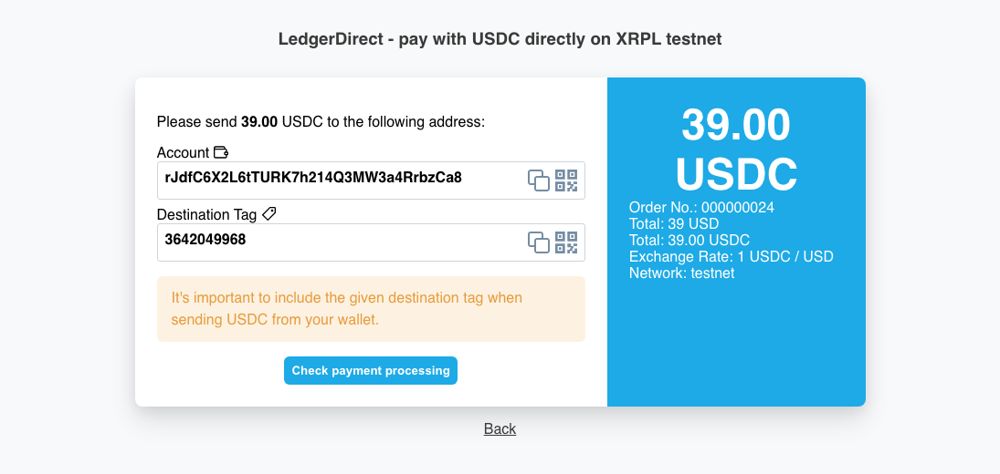

# LedgerDirect - Magento2 Payment Plugin

[](https://github.com/ledger-direct/ledger-direct-magento2/actions/workflows/ci.yml)
[](LICENSE)


LedgerDirect is a payment plugin for Magento2. Receive crypto and stablecoin payments directly – without middlemen,
intermediary wallets, extra servers or external payment providers. Maximum control, minimal detours!

Project Website: https://www.ledger-direct.com

GitHub: https://github.com/ledger-direct/ledger-direct-magento2



## Compatibility
- Magento Open Source / Adobe Commerce **2.4.7** and **2.4.8**
- PHP **8.2**, **8.3**, or **8.4**

## Available currencies:
- XRP (XRP Ledger)
- RLUSD (XRP Ledger)

### Install & setup instructions

##### 1. Run the below command to install the payment module from Composer
 ```
 composer require hardcastle/ledger-direct-magento2
 ```
##### 2. Run the below command to upgrade the payment module
 ```
 php bin/magento setup:upgrade
 ```
##### 3. Run the below command to re-compile the payment module
 ```
 php bin/magento setup:di:compile
 ```
##### 4. Run the below command to deploy static-content files like (images, CSS, templates and js files)
 ```
 php bin/magento setup:static-content:deploy -f
 ```
### 2. Configure the plugin
- Go to "Stores" > "Configuration" > "Sales" > "Payment Methods"
- Find "LedgerDirect" in the list of payment methods and click "Configure"
- Enter your Merchant Wallet Address (the address where you want to receive payments)
- Configure any additional settings as needed (e.g., which network to use (Testnet or Mainnet), which currencies to accept, etc.)

## Accepting Stablecoin Payments
- To accept stablecoin payments, ensure you have the corresponding currencies (RLUSD, USDC, EURC etc.) enabled in the plugin settings
- The merchant wallet address needs to have the corresponding trust lines set up for the stablecoins you want to accept
