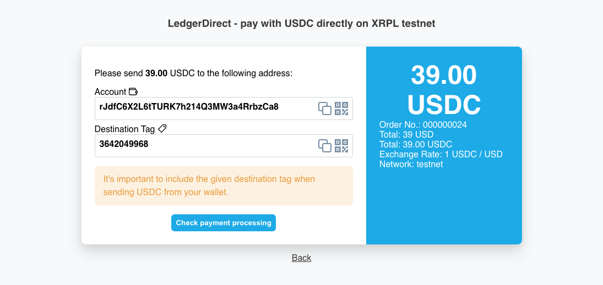

# LedgerDirect - Magento2 Payment Plugin

[](https://github.com/ledger-direct/ledger-direct-magento2/actions/workflows/ci.yml)
[](LICENSE)


LedgerDirect is a payment plugin for Magento2. Receive crypto and stablecoin payments directly – without middlemen,
intermediary wallets, extra servers or external payment providers. Maximum control, minimal detours!

Project Website: https://www.ledger-direct.com

GitHub: https://github.com/ledger-direct/ledger-direct-magento2



## Compatibility
- Magento Open Source / Adobe Commerce **2.4.7** and **2.4.8**
- PHP **8.2**, **8.3**, or **8.4**
- [`hardcastle/ledger-direct-core`](https://packagist.org/packages/hardcastle/ledger-direct-core) — the
  platform-agnostic XRPL and pricing logic shared by all LedgerDirect plugins. Composer installs it
  together with the module.

## Available currencies:
- XRP (XRP Ledger)
- RLUSD (XRP Ledger)
- USDC (XRP Ledger)

### Install & setup instructions

##### 1. Run the below command to install the payment module from Composer
 ```
 composer require hardcastle/ledger-direct-magento2
 ```
 This also installs `hardcastle/ledger-direct-core` from Packagist. If you place the module under
 `app/code` instead, require the core at project level yourself:
 ```
 composer require hardcastle/ledger-direct-core:^0.4
 ```
##### 2. Run the below command to upgrade the payment module
 ```
 php bin/magento setup:upgrade
 ```
##### 3. Run the below command to re-compile the payment module
 ```
 php bin/magento setup:di:compile
 ```
##### 4. Run the below command to deploy static-content files like (images, CSS, templates and js files)
 ```
 php bin/magento setup:static-content:deploy -f
 ```
### 2. Configure the plugin
- Go to "Stores" > "Configuration" > "Sales" > "Payment Methods"
- Find "LedgerDirect" in the list of payment methods and click "Configure"
- Enter your Merchant Wallet Address (the address where you want to receive payments)
- Configure any additional settings as needed (e.g., which network to use (Testnet or Mainnet), which currencies to accept, etc.)

## Accepting Stablecoin Payments
- To accept stablecoin payments, enable the corresponding payment methods (RLUSD, USDC) under "Payment Methods"
- The merchant wallet address needs to have the corresponding trust lines set up for the stablecoins you want to accept

## Payment page
After the checkout the customer is sent to the LedgerDirect payment page, which shows the amount, the receiving
account and the destination tag. The page is reachable by the order's key (Magento's own `protect_code`, the secret
behind the guest order view), so guest orders work and the URL keeps working without a login — the address bar
carries it right after the checkout.

The page shows one of five states and polls the shop every eight seconds:

| State | Meaning |
|---|---|
| waiting | Nothing has arrived and the quoted amount is still valid — a countdown shows for how long |
| expired | Nothing has arrived and the quote has passed — a button fetches an updated amount, account and tag stay the same |
| partial | Something arrived in the quoted asset, but not enough — the page says what arrived and what is still due; a second payment adds up |
| wrong_asset | Something arrived, but in another token or from another issuer — nothing is credited, the full amount is still due |
| settled | Paid — the customer is sent on to the order confirmation, or to the order view when the checkout session is gone |

The status endpoint (`/ledger-direct/payment/status?id=<order entity id>&key=<protect_code>`) returns the same payload
as every other LedgerDirect plugin, plus a `redirect` URL once the order no longer waits for payment — whether it was
paid on the ledger or canceled by the merchant. A wrong key or id is refused with 403 without saying whether the
order exists. The ledger is synced at most once every five seconds per receiving account, however many pages poll.

## Settlement
Once the payment is found on the ledger, the module checks the delivered amount against the quote (XRP within
0.15 %, stablecoins at least the quoted value from the quoted issuer — the core's `SettlementPolicy`), creates an
offline-captured invoice, moves the order to the method's *settled status* (`processing` by default) and sends the
order and invoice emails — the order confirmation is deliberately held back until then. This runs from the payment
page and its status poll and, for customers who close the tab after sending, from the
`ledger_direct_settle_pending_orders` cron job every five minutes, so Magento's cron must be running. The cron makes
one node request per receiving account and network, then matches every open order against the stored transactions.

The order's *Payment Information* — on the admin order view, in the customer's order view and in the order emails —
lists what was quoted (asset, amount, rate, receiving account, destination tag, issuer for a stablecoin), the payment
status, what arrived and what is still due, and the transaction hash as a link to the XRPL explorer.

A payment that does not settle the order — a shortfall, or a token other than the quoted one — moves the order to
the status **XRPL payment incomplete** (state `pending_payment`) with the amounts and the transaction hash in the
status history; partial payments add up, and a top-up of the shortfall settles. Magento cancels orders left in the
status `pending_payment` after `Stores > Configuration > Sales > Orders Cron Settings > Pending Payment Order
Lifetime` (480 minutes by default); an order with the *XRPL payment incomplete* status is not cancelled by that job,
because there is real money on the ledger for it.

## Uninstall
`bin/magento module:uninstall Hardcastle_LedgerDirect` keeps the module's tables. Adding `--remove-data` drops
them, including `ledger_direct_xrpl_destination_tag` — the only record of which destination tags were already
issued. A reinstall then starts a fresh counter, and payments for orders that are still waiting can no longer be
matched. Only remove the data once no LedgerDirect order is open.

## External Services
LedgerDirect uses public APIs from Coingecko, Binance, and Kraken to retrieve current cryptocurrency exchange
rates. These rates are needed to correctly calculate and display payments. No personal or payment data is sent
to these services; only requests for current rates are made when a payment is processed or displayed. Rates are
cached briefly in Magento's cache so that a short outage of a rate source does not interrupt checkout.

- Coingecko API: [Terms of Service](https://www.coingecko.com/en/terms), [Privacy Policy](https://www.coingecko.com/en/privacy)
- Binance API: [Terms of Use](https://www.binance.com/en/terms), [Privacy Policy](https://www.binance.com/en/privacy)
- Kraken API: [Terms of Service](https://www.kraken.com/legal), [Privacy Policy](https://www.kraken.com/privacy)

## Development

The core library is developed alongside the plugins. To work against a local core checkout instead of the
released version, add a path repository to the *Magento project's* `composer.json` and require the branch:

```
composer config repositories.ledger-direct-core path ../LedgerDirectCorePHP/ledger-direct-core-php
composer require hardcastle/ledger-direct-core:dev-master
```

Keep the module's own constraint on the released version; the project-level override is a local concern.
